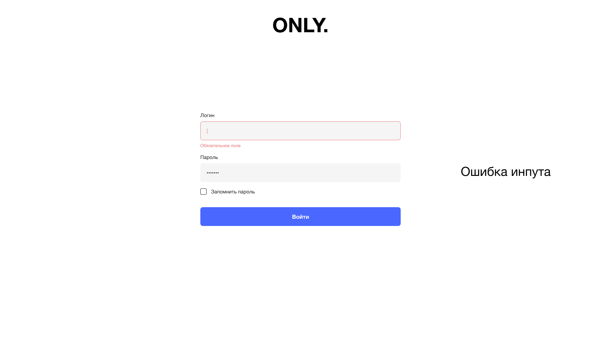
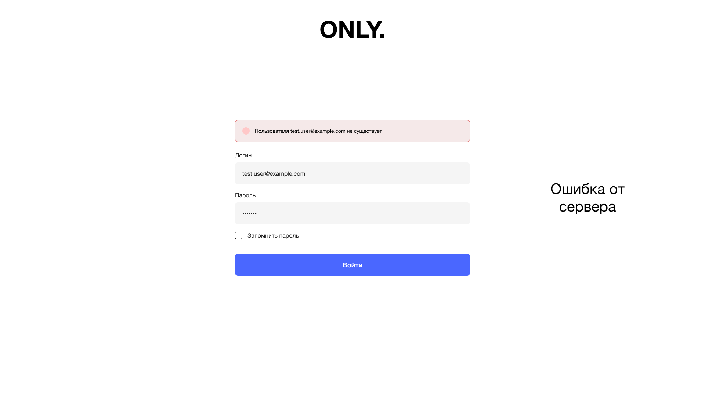
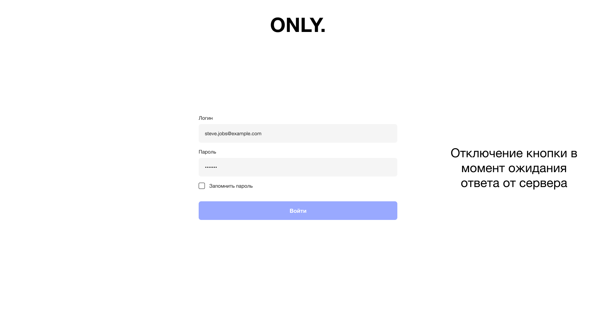
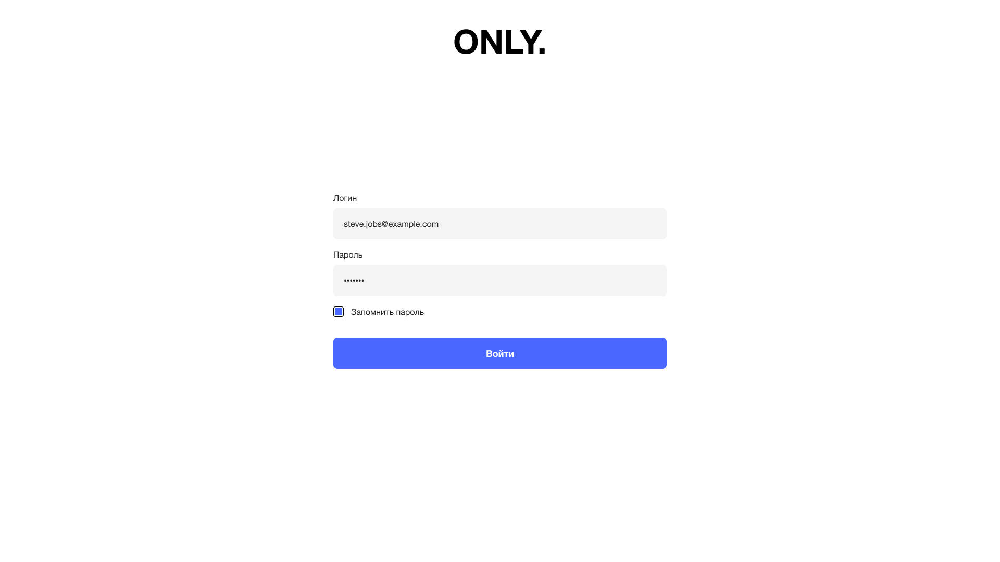
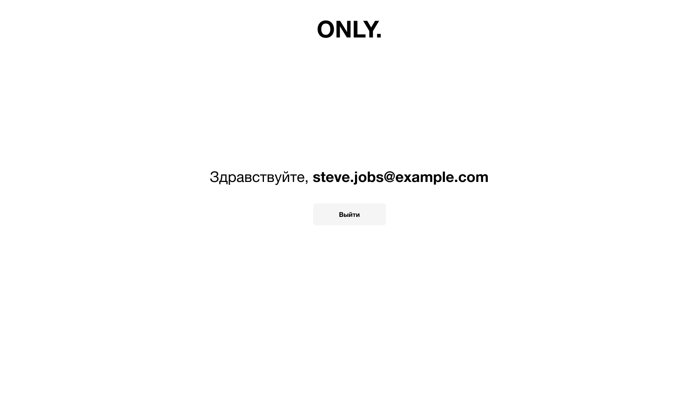

# Authorization application
Example of an authorization application
## GitHub Pages
https://wzdorowa.github.io/authorization/

## Stack
React, TypeScript, React Router, styled-components, React Hook Form, RxJS

## Макеты

| Авторизация (ошибка инпута) | Авторизация (ошибка ceрвера) | Авторизация (disabled кнопки) | Авторизация | Профиль |
| :-----------: | :---------: | :-----------: | :-----------: | :------: |
|   |  |  |  |  |