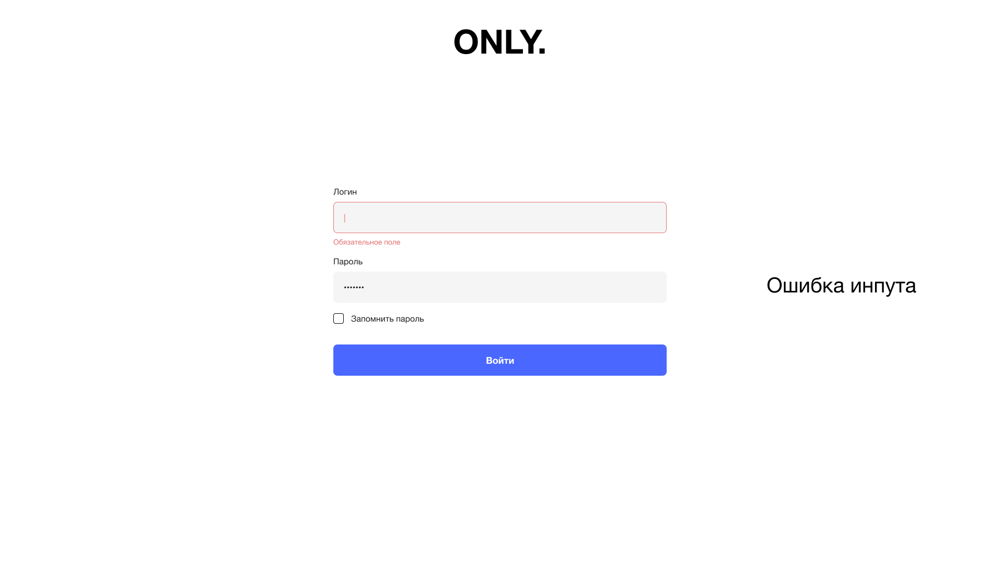
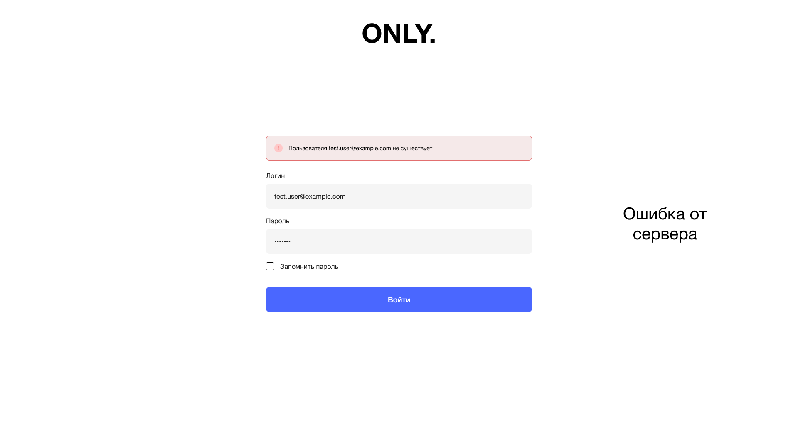
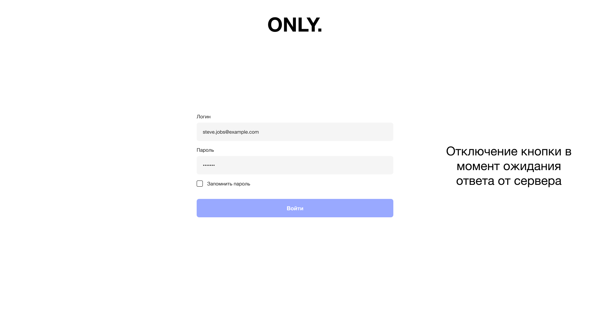
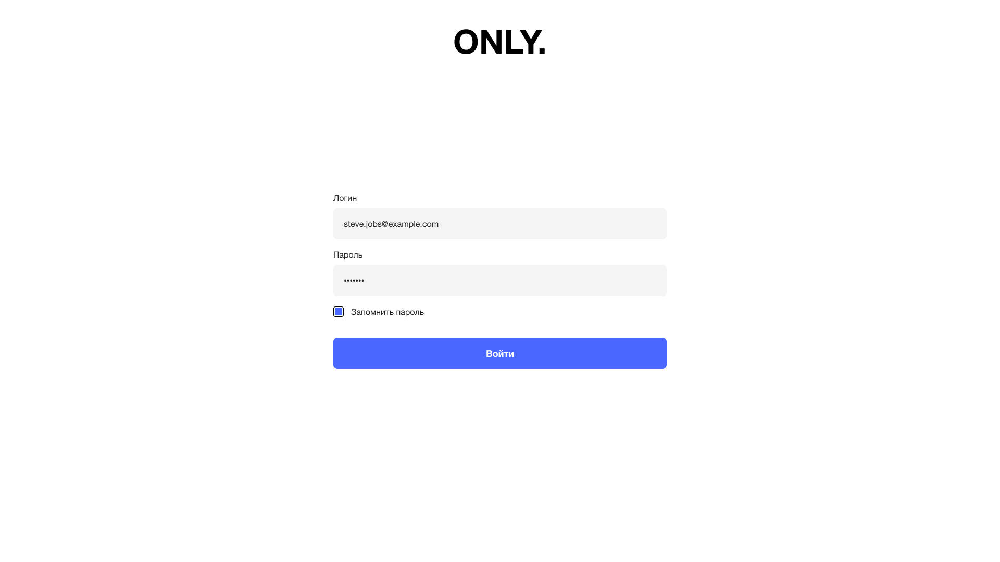
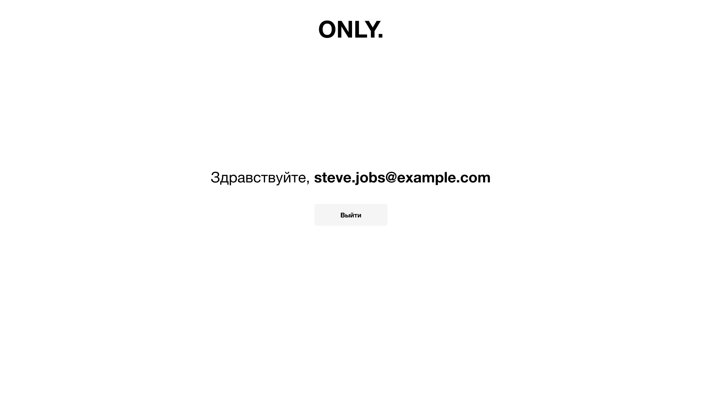

# Authorization application
Example of an authorization application
## GitHub Pages
https://wzdorowa.github.io/authorization/

## Stack
React, TypeScript, React Router, styled-components, React Hook Form, RxJS

## Layouts

| Authorization (input error) | Authorization (server error) | Authorization (button disabled) | Authorization | Profile |
| :-----------: | :---------: | :-----------: | :-----------: | :------: |
|   |  |  |  |  |